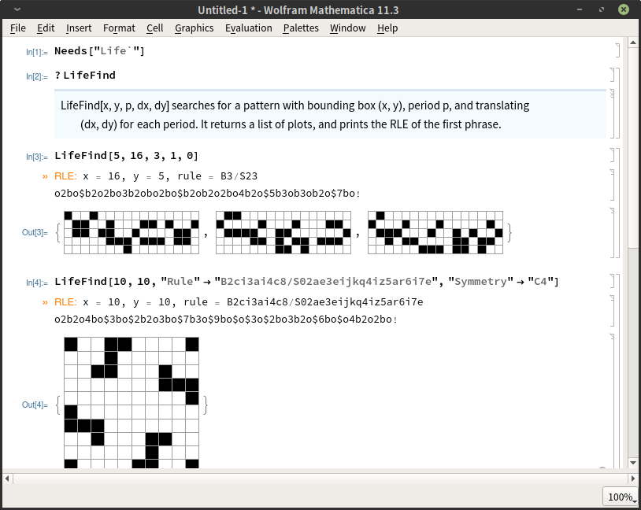

# [LifeFind](https://github.com/AlephAlpha/LifeFind)
A simple and naïve Game of Life pattern searcher written in Wolfram Language.

---

[English version of this file translated by Google.](README_en.md)

---

这是个用来搜索生命游戏（以及别的 Life-like 的元胞自动机）里的图样的 Mathematica 包。搜索方式是把图样要满足的条件看成一个 [SAT 问题](https://en.wikipedia.org/wiki/Boolean_satisfiability_problem)，然后用 Mathematica 自带的 [`SatisfiabilityInstances`](http://reference.wolfram.com/language/ref/SatisfiabilityInstances.html) 函数求解。

这个包就是写着玩的，搜索速度慢得离谱，完全无法搜索周期稍大的图样。如果需要实用一点的搜索工具，推荐使用 [Logic Life Search](https://github.com/OscarCunningham/logic-life-search)，或者见[《生命游戏搜索程序汇总》](https://www.jianshu.com/p/81c90ba597ea)。

我不怎么懂编程，代码肯定有很多 bug。遇到问题欢迎来提 [issue](https://github.com/AlephAlpha/LifeFind/issues)。

## 下载与安装

直接点 Github 页面右上角的那个绿色的按钮 “Clone or download” 就能下载。也可以用 `git clone`：

```bash
git clone https://github.com/AlephAlpha/LifeFind.git
```

安装的方式见[这里](http://support.wolfram.com/kb/5648)。

安装了之后，在 Mathematica 中用以下命令来加载：

```Mathematica
Needs["Life`"]
```

或者：

```Mathematica
<< Life`
```

## 搜索图样



包里用来搜索图样的函数是 `SearchPattern` 和 `LifeFind`。用法都一样，区别在于 `SearchPattern` 输出的是一个数组，而 `LifeFind` 输出的是图片，还顺带打印出图样的 [RLE](http://www.conwaylife.com/wiki/Run_Length_Encoded)。

`LifeFind[x, y, p, dx, dy]` 搜索的是大小不超过 `(x, y)`，周期为 `p`，每个周期平移 `(dx, dy)` 的图样。比如说，要搜索大小不超过 5×16，周期为 3，速度为 c/3 的竖直方向的飞船，只需要：

```Mathematica
LifeFind[5, 16, 3, 1, 0]
```

可以省略 `dx` 和 `dy`，此时默认 `dx` 和 `dy` 都是 0，也就是说搜索的是静物或者振荡子。如果连 `p` 也省略，则默认周期是 1，也就是说搜索的是静物。

搜索结果是随机的，搜索需要的时间也很不稳定。如果搜索时间过长，可以用 `Alt+.` （在命令行界面是 `Ctrl+C`）来中断。

还可以设置以下的选项：

#### `"Rule"`

表示搜索的规则。目前仅支持 [totalistic](http://conwaylife.com/wiki/Totalistic_Life-like_cellular_automaton) 或者 [isotropic non-totalistic](http://conwaylife.com/wiki/Isotropic_non-totalistic_Life-like_cellular_automaton) 的 Life-like 的规则，规则的写法见 [Golly 的帮助文件](http://golly.sourceforge.net/Help/Algorithms/QuickLife.html)。不支持六边形的规则，也不支持后面加 `V` 表示冯·诺依曼邻域的写法。

#### `"Symmetry"`

表示搜索的对称性。支持的对称性包括 "C1"，"C2"，"C4"，"D2-"，"D2\\\\"，"D2|"，"D2/"，"D4+"，"D4X"，"D8"。对称性的前面两个字符代表图样的对称群，"Cn" 和 "Dn" 分别代表[循环群](https://en.wikipedia.org/wiki/Cyclic_group)和[二面体群](https://en.wikipedia.org/wiki/Dihedral_group)； "D2" 和 "D4" 后面的符号代表图样的对称轴。这些对称性的写法是我从 [Logic Life Search](https://github.com/OscarCunningham/logic-life-search) 抄来的，具体的说明见[这里](http://www.conwaylife.com/wiki/Symmetry)。

#### `"Agar"`

此选项默认为 `False`。当设为 `True` 时，搜索的是[琼脂](http://www.conwaylife.com/wiki/Agar)，而非有限的图样。也可设置为 `{True, False}` 或 `{False, True}`，使得搜索的图样在竖直或水平方向上有限，在另一个方向上则无限循环。

#### `"Changing"`

此选项默认为 `False`，但搜索振荡子时经常会搜出静物。当设为 `True` 时，会只搜索变化的图样，也就是说会排除掉静物；也可设置为 `{i, j}`，这里 `i` 和 `j` 是两个正整数，此时搜索的是第 `i` 代和第 `j` 代不一样的图样。比如说要搜索周期为 4 的振荡子，可以设 `"Changing" -> {1, 3}`。注意设置此选项会使搜索速度变慢。

#### `"Periodic"`

此选项默认为 `True`，也就是说，搜索的是周期性的图样（静物、振荡子、飞船、琼脂）。如果要搜索非周期性的图样，可以把此选项设为 `False`。一般和 `"KnownCells"` 或 `"OtherConditions"` 配合使用。

#### `"RandomArray"`

`SearchPattern` 和 `LifeFind` 默认会返回随机的结果，这是通过搜索的时候给要搜索的数组异或上一个随机数组来实现的。如果不需要随机的结果，可以把此选项设成是 1，此时异或上的数组取成全部是 1；也可以把此选项设成是 0，此时异或上的数组取成全部是 0，不过搜索结果一般也全是 0，除非 `"Changing"` 设成是 `True`。

#### `"KnownCells"`

此选项用于指定已知的细胞，其值是一个三维数组，三个维度分别对应 `p`，`x`，`y`。数组中 `1` 代表已知的活细胞，`0` 代表已知的死细胞，其它的值代表未确定的细胞。比如说，`"KnownCells" -> {{{1, _}, {_, 0}}}` 表示要搜索的图样第一代最左上方的细胞是 1，第二行第二列的细胞是 0。

#### `"OtherConditions"`

此选项用于指定需要满足的其它条件。条件中用 `C[i, j, t]` 来表示 `(i, j)` 处的细胞的第 `t` 代。这个条件最好写成[合取范式](https://en.wikipedia.org/wiki/Conjunctive_normal_form)或者容易化成合取范式的形式。比如说，要找大小不超过 16×16 的周期 2 的[凤凰](http://www.conwaylife.com/wiki/Phoenix)，可以用：

```Mathematica
LifeFind[16, 16, 2,
 "OtherConditions" ->
  Array[! C[##, 1] || ! C[##, 2] &, {16, 16}, 1, And]]
```

再比如说，要找大小不超过 17×17，周期为 4，速度为 c/2 的 [glide symmetric](https://en.wikipedia.org/wiki/Glide_reflection) 的竖直方向的飞船，可以用：

```Mathematica
LifeFind[17, 17, 4, 2, 0,
 "OtherConditions" ->
  Array[C[##, 1] \[Equivalent] C[# + 1, 17 + 1 - #2, 3] &, {17, 17}, 1, And]]
```

## 其他函数

除了 `SearchPattern` 和 `LifeFind`，这个包里还有以下几个函数：

#### `RuleNumber`

把一个规则转写成一个大数字，可以用在 Mathematica 的 [`CellularAutomaton`](https://reference.wolfram.com/language/ref/CellularAutomaton.html) 函数中，比如说生命游戏（`B3/S23`）对应的规则在 Mathematica 中是 `{RuleNumber["B3/S23"], 2, {1, 1}}`。只支持前面说的那些规则。

#### `ToRLE`

把一个数组转换成 [RLE](http://www.conwaylife.com/wiki/Run_Length_Encoded) 格式。可以设置 `"Rule"` 选项。只支持两种状态的规则，也就是说，数组只能由 0 和 1 组成。

#### `FromRLE`

把 RLE 转换成一个数组。只支持两种状态的规则。

#### `FromAPGCode`

把 [apgcode](http://www.conwaylife.com/wiki/Apgcode) 转换成一个数组。只支持两种状态的规则。

#### `PlotAndPrintRLE`

画出一个图样，并打印出它的 RLE。图样以二维数组的形式输入。也可以输入一个二维数组的列表，列表中每个元素代表图样的一代，此时 `PlotAndPrintRLE` 会画出它的每一代，并打印第一代的 RLE。可以设置 `"Rule"` 选项。`LifeFind` 相当于 `PlotAndPrintRLE` 和 `SearchPattern` 的复合。

#### `Predecessor`

尝试搜索图样的[祖先](http://www.conwaylife.com/wiki/Predecessor)。`Predecessor[pattern, n]` 表示搜索第 `n` 代的祖先。不指定 `n` 时，`n` 默认是 1，也就是说，搜的是[父母](http://www.conwaylife.com/wiki/Parent)。搜索范围有限，搜不出结果不能说明这个图样是[伊甸园](http://www.conwaylife.com/wiki/Garden_of_Eden)。可以设置 `"Rule"` 选项。

#### `CA`

将一个图样演化 `n` 代，输出一个三维数组。`CA[pattern, n, "Rule" -> rule]` 相当于 `CellularAutomaton[{RuleNumber[rule], 2, {1, 1}}, {pattern, 0}, gen]`。

#### `ExportGIF`

把一个图样导出成 GIF 文件。用法是 `ExportGIF[file, pattern, gen]`，这里 `file`、`pattern`、`gen` 分别为要导出到的文件名、图样（一个数组）、绘制的代数。可以设置 `"Rule"` 和 `"DisplayDurations"` 两个选项，后者表示 GIF 每一帧的时长，单位为秒。

#### `Rules`

输入一个图样（作为一个三维数组），给出它所满足的所有规则。结果以一个[关联列表](https://reference.wolfram.com/language/ref/Association.html)的形式给出，其中 `True` 和 `False` 分别表示规则中必须有/没有这一项。比如说，`<|{"B", "0"} -> False, {"B", "3", "a"} -> True, {"S", "4", "k"} -> False|>` 表示规则中必须有 `B3a`，不能有 `B0` 和 `S4k`，其它的项则可有可无。暂不支持自动判断是不是 `B0` 的规则；如果是 `B0` 的规则，需手动设置选项 `"B0" -> True`。

#### `$Rule`

这只是一个符号，不是函数，代表全局的默认规则（即 `"Rule"` 选项的默认值）。它的默认值是 `"B3/S23"`（生命游戏）。可以更改它的值，这样使用别的函数的时候就不必专门设置 `"Rule"` 选项。也可以在 [`Block`](http://reference.wolfram.com/language/ref/Block.html) 中使用，以更改局部的默认规则。
